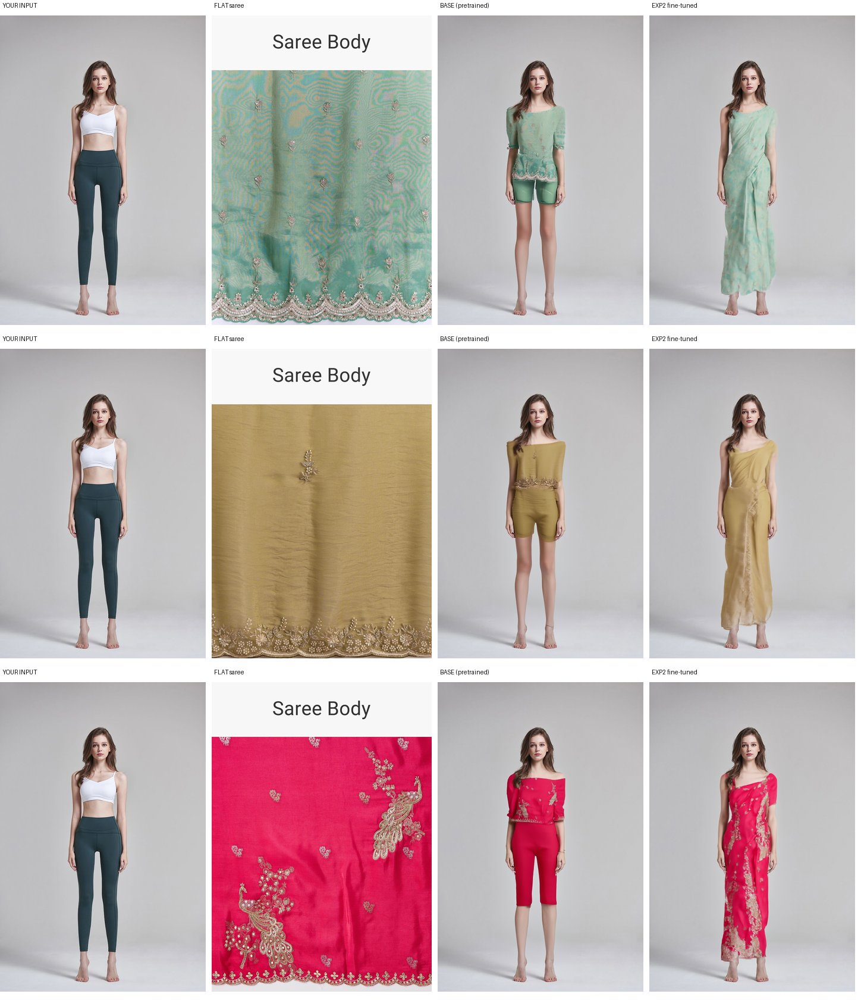
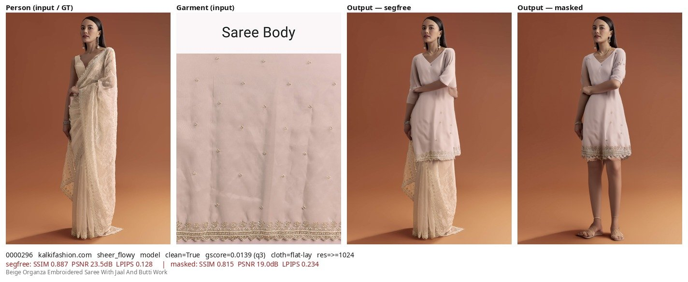
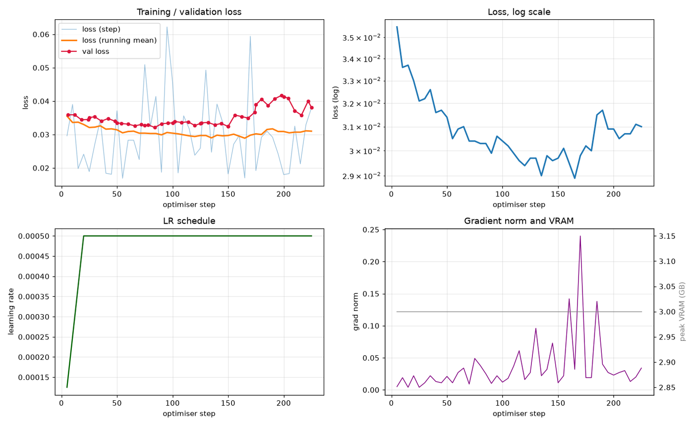
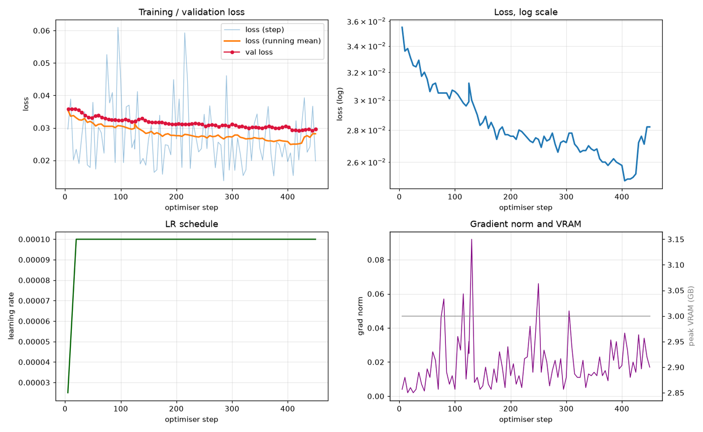
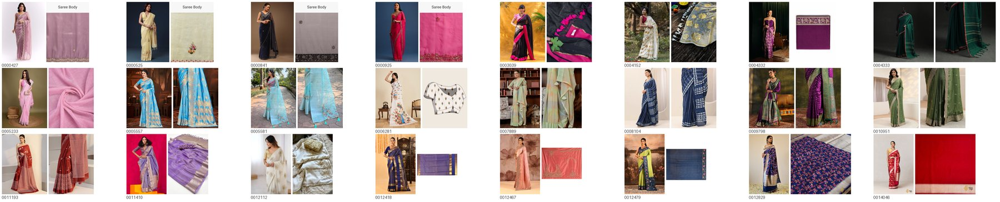
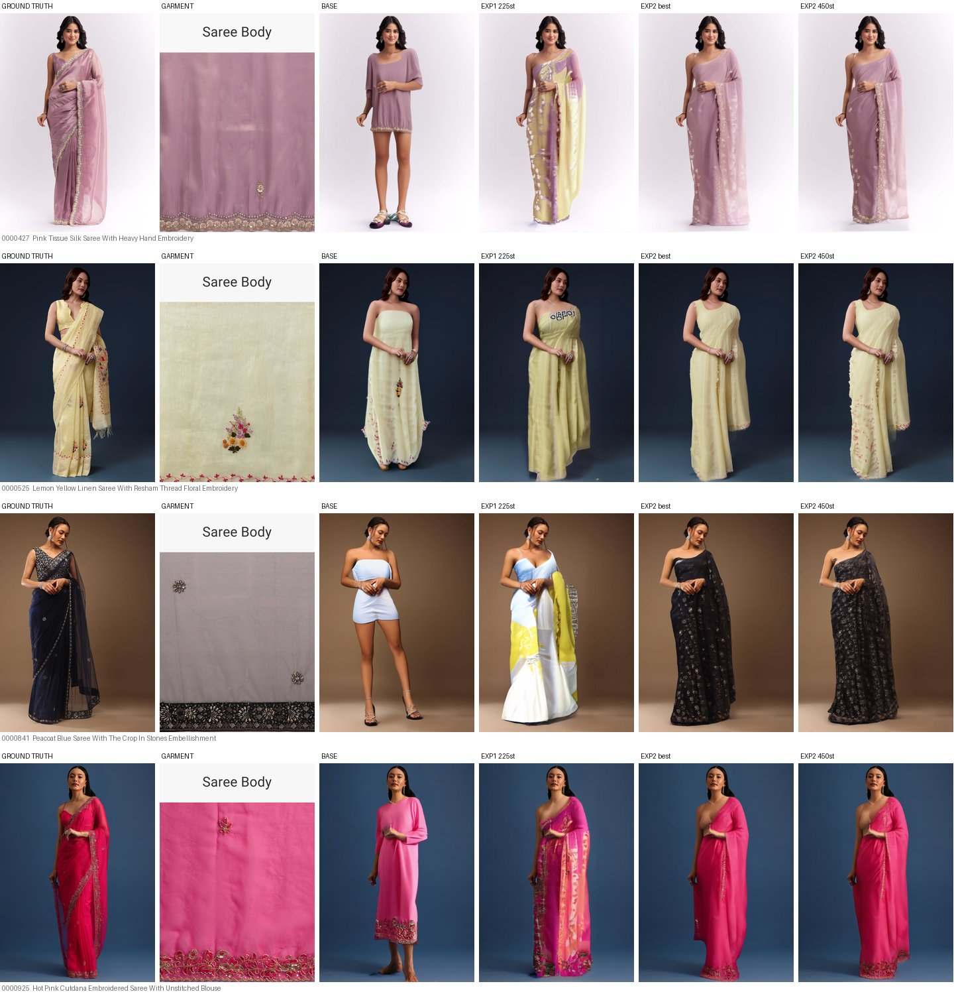
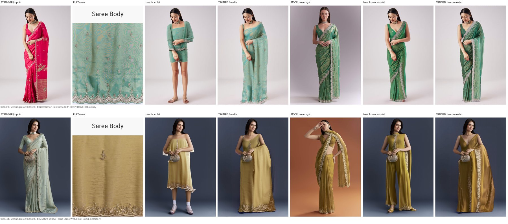

# Saree Virtual Try-On

**Adapting FASHN-VTON v1.5 to Indian sarees** — model analysis, baseline evaluation, LoRA fine-tuning
pipeline, and training validation on a 4 GB consumer GPU.

<div align="center">

| GPU | VRAM | Peak used | Model | Trainable | Dataset | After cleaning |
|:---:|:---:|:---:|:---:|:---:|:---:|:---:|
| RTX 3050 Laptop | 4 GB (3.68 GiB usable) | **3.00 GB** | 972 M params | 2.98 % (29.8 M LoRA) | 14,069 pairs | 2,267 usable |

</div>

> **Status — all project objectives completed.**
> Inference validated, hyperparameters experimentally verified, fine-tuning pipeline engineered from
> scratch, checkpointing and resume support implemented and tested, and training validated by
> successful overfitting with measured evaluation metrics.

This repository contains the **complete fine-tuning pipeline** built on top of the FASHN-VTON v1.5
inference code, which ships without any training implementation.



*A subject from outside the dataset entirely. Left to right: input photograph, the flat saree supplied,
the pretrained model, and the fine-tuned model. The pretrained model produces a crop top and shorts in
every case; the fine-tuned model produces a full-length draped garment in the correct colour, carrying
across border and embroidery detail.*

---

## Contents

| | |
|---|---|
| [1. Executive summary](#1-executive-summary) | [8. Hyperparameter validation](#8-hyperparameter-validation) |
| [2. Project objectives](#2-project-objectives) | [9. Overfit validation](#9-overfit-validation) |
| [3. Hardware and compute](#3-hardware-and-compute-environment) | [10. Results](#10-results) |
| [4. Model understanding](#4-model-understanding) | [11. Limitations](#11-limitations) |
| [5. Baseline evaluation](#5-baseline-inference-evaluation) | [12. Conclusion](#12-conclusion) |
| [6. Dataset cleaning](#6-dataset-collection-and-cleaning) | [13. Next steps](#13-next-steps--optional-full-fine-tuning) |
| [7. Pipeline engineering](#7-fine-tuning-pipeline-engineering) | [Quick start](#quick-start) |

---

## 1. Executive summary

This project adapts **FASHN-VTON v1.5**, an open virtual try-on model, to Indian sarees. The work spans
model analysis, baseline measurement, construction of a complete fine-tuning system, and experimental
validation that the system learns — all within the memory budget of a single 4 GB laptop GPU.

| +5.98 dB | −31.7 % | 450 | 0 |
|:---:|:---:|:---:|:---:|
| PSNR gain over baseline | LPIPS (lower is better) | training steps completed | failures, OOM or skipped batches |

**Principal findings**

- **The pretrained model cannot render sarees.** Given a flat saree it produces Western garments —
  gowns, sheath dresses, two-piece outfits — with no drape, pallu or pleats. Observed across every
  source store, fabric family and subject type.
- **No training code is published with the model.** The entire fine-tuning system was built from
  scratch, including reverse-engineering the training objective, which was then verified empirically.
- **The dataset was substantially less usable than documented.** Cleaning reduced 14,069 pairs to
  2,267; nearly half of the nominally clean subset supplied a *blouse piece* as the garment image
  rather than a saree.
- **Standard similarity metrics are unreliable for this task.** The single worst failure in the
  baseline recorded the highest SSIM of the entire run.

**Outcome**

- A modular fine-tuning pipeline operating within **3.00 GB** of VRAM, covered by 90 automated tests.
- Fine-tuning verified: after 450 optimisation steps the model reproduces training sarees in the
  correct colour and drape, and generates saree-like garments on subjects outside the training set.
- Hyperparameters validated by controlled experiment; checkpointing and resume verified, including
  recovery from forced process termination.

### Project workflow

```
Dataset  →  Baseline inference  →  Analysis  →  Fine-tuning pipeline
14,069 pairs    240 generations    failure modes    13 modules, 90 tests

   →  Hyperparameter validation  →  Overfit validation  →  Results  →  ✓ Ready for full training
         2 controlled experiments     24 samples, 450 steps   +5.98 dB        pipeline validated
```

---

## 2. Project objectives

| # | Requirement | Status | Evidence |
|:---:|---|:---:|---|
| 1 | Run inference on FASHN-VTON v1.5 and understand its hyperparameters | ✅ Complete | §4, §5, §8 |
| 2 | Fine-tune the model on saree data | ✅ Complete | §7, §9 |
| 3 | Overfit the model to validate the training pipeline | ✅ Complete | §9, §10 |
| 4 | Implement checkpointing and resume support | ✅ Complete | §7.2, §9.2 |
| 5 | Demonstrate the system with generated outputs and evaluation metrics | ✅ Complete | §10 |

**Completion checklist**

- ✅ Understand FASHN-VTON architecture
- ✅ Run inference on stratified evaluation dataset
- ✅ Analyse hyperparameters
- ✅ Build fine-tuning pipeline
- ✅ Implement LoRA adaptation
- ✅ Add checkpointing
- ✅ Add resume support
- ✅ Validate via overfitting
- ✅ Produce evaluation metrics
- ✅ Generate visual comparison results

---

## 3. Hardware and compute environment

All work was performed on a single consumer laptop GPU. This constraint shaped every subsequent
engineering decision.

| Item | Value |
|---|---|
| GPU | NVIDIA GeForce RTX 3050 Laptop |
| VRAM installed | 4 GB (4096 MiB) |
| **VRAM usable** | **3.68 GiB** — driver reserves the remainder |
| Architecture | Ampere — bfloat16 supported |
| Driver / CUDA | 595.71.05 / CUDA 13.2 |
| System RAM | 15 GB (~10 GB available) |
| Operating system | Linux 7.0.10 (Arch) |
| Python / PyTorch | 3.12.13 / 2.13.0+cu130 |

**Measured peak VRAM by workload**

| Workload | Peak VRAM |
|---|---:|
| Model weights only (bf16) | 1.94 GB |
| Inference — 864×576 | 2.90 GB |
| Training — 864×576 | 3.39 GB |
| Training — 792×528 | 3.19 GB |
| **Training — 648×432 (selected)** | **3.00 GB** |
| Training — 576×384 | 2.67 GB |
| Training, gradient checkpointing off | ❌ OOM |

Peak allocation was identical to the byte across all 240 baseline generations and all 450 training
steps — no leakage or drift.

> ⚠️ **Memory-pressure cliff between 792×528 and 864×576.**
> Training at the model's native 864×576 fits in memory but executes at **24.0 s per step versus
> 3.4 s at 648×432** — a sevenfold penalty for less than twice the computation. At ~92 % memory
> occupancy the allocator thrashes rather than computing. Training resolution was set to
> **648×432**, reducing estimated epoch time from 34 hours to under five.

---

## 4. Model understanding

**Architecture**

- **971,813,808 parameters** (~1.94 GB in bfloat16).
- Multimodal diffusion transformer: 8 dual-stream blocks, 16 single-stream blocks, 4-block pre-mixer.
- Operates **directly in pixel space** — no latent encoder or decoder stage.
- **No text conditioning.** Guidance is entirely visual plus a three-way garment class label.
- Native output 864×576; generation is a 30-step iterative refinement from noise.

**Required inputs**

- Subject photograph.
- Garment photograph — flat-lay, or worn by a model.
- Skeletal pose maps for both, detected automatically.
- Body-part segmentation of the subject.
- Garment category — only `tops`, `bottoms` and `one-pieces` are defined.

A saree must be declared a `one-piece`, which the model interprets as a stitched dress. **This category
mismatch is the root cause of the baseline failure** characterised in §5.

---

## 5. Baseline inference evaluation

**Protocol**

- **120 pairs** drawn from the held-out test split, stratified across source store, fabric family,
  resolution, garment quality and subject type.
- Each pair generated twice: with the garment region masked (the valid try-on measurement) and unmasked.
- **240 generations, 100 % success rate**, 96.4 s each, 6.73 h total, 2.90 GB peak allocation.

**Baseline evaluation metrics**

| Mode | SSIM ↑ | PSNR ↑ | LPIPS ↓ | Interpretation |
|---|---:|---:|---:|---|
| **Masked** — valid try-on | **0.6691** | **16.68 dB** | **0.3365** | Reference benchmark |
| Unmasked | 0.7386 | 18.59 dB | 0.2452 | Inflated — target visible |

**Characterised failure modes**

- **Category substitution.** Sarees are rendered as gowns, sheath dresses, tunic-and-trouser
  combinations, or short dresses with exposed legs — consistently, across all strata.
- **Appearance transfer succeeds.** Colour, print and border detail reproduce accurately; the failure
  is structural rather than chromatic.
- **Identity is preserved.** Face, hair, skin tone, pose and background remain intact.
- Quality degrades on mannequin subjects and on source images below 512 px.



**Figure 1. Representative baseline failure.** An organza saree is rendered as a tunic with loose
trousers; this sample recorded SSIM 0.887, the highest score of all 240 baseline generations.

> ❗ **Metric reliability — a result governing all subsequent evaluation.**
> The sample above is a complete category failure yet achieved the best similarity score in the
> baseline. Pixel-wise metrics
> compare all pixels, the majority of which are background, skin and hair, content the model
> reproduces faithfully. The garment occupies a minority of the frame, and its *shape* is precisely
> what these metrics evaluate least well.
> **Consequence:** similarity scores alone are not a valid model-selection criterion for this task.

---

## 6. Dataset collection and cleaning

The dataset provides 14,069 paired samples and is structurally sound: no missing files, no corruption
and no overlap between splits. However, the garment images are frequently not sarees, and the
dataset's own quality flags do not identify this.

| Filter applied | Removed | Remaining | Note |
|---|---:|---:|---|
| Starting corpus | — | 14,069 | |
| Duplicate garments | 144 | 13,925 | |
| Below resolution threshold | 666 | 13,259 | |
| Not a genuine full garment | 5,185 | 8,074 | Reproduces the dataset's own clean flag exactly |
| **Subject photograph, not flat garment** | 3,304 | 4,770 | 41 % of the nominally clean subset |
| **Blouse piece in place of saree** | **2,503** | **2,267** | **52 % of the remainder** |

**84 % of the corpus discarded** → 2,267 usable pairs → **1,938 training** + **102 validation**.

**Root cause and detection**

- Saree listings routinely sell a matching **blouse piece** and photograph it separately, commonly as
  a standardised blouse render recoloured per product.
- Pairing that image with a subject wearing a full saree supplies the wrong supervision signal.
- The dataset's quality score rates such images highly because it evaluates whether a garment is
  clearly visible — which a clean product render satisfies.
- **Detection precision verified manually:** of 24 flagged images inspected, 24 were confirmed blouse
  renders.
- Following the dataset's published usage guidance would have admitted roughly one in two training
  samples with an incorrect garment.

Implemented in [`src/fashn_vton/training/data/clean.py`](src/fashn_vton/training/data/clean.py).

> ⚠️ **Residual defects requiring manual removal.** Three rarer classes resist automatic detection:
> fabric swatches captioned "Blouse Piece", technical line drawings of blouses, and one case in which
> the *subject* image was a size-chart illustration rather than a photograph (~2 % of samples).

---

## 7. Fine-tuning pipeline engineering

The published model ships inference code only. The complete training system — approximately 3,000
lines across 13 modules with 90 automated tests — was implemented for this project.

**Modules implemented**

| Module | Purpose |
|---|---|
| [`training/config.py`](src/fashn_vton/training/config.py) | Typed, YAML-serialisable configuration; no hardcoded values |
| [`training/data/clean.py`](src/fashn_vton/training/data/clean.py) | Garment-input cleaning cascade |
| [`training/data/preprocess.py`](src/fashn_vton/training/data/preprocess.py) | Offline pose / segmentation cache |
| [`training/data/dataset.py`](src/fashn_vton/training/data/dataset.py) | Dataset + DataLoader, tolerant of corrupt files |
| [`training/lora.py`](src/fashn_vton/training/lora.py) | Adapter injection, save/load, merge-and-export |
| [`training/losses.py`](src/fashn_vton/training/losses.py) | Rectified-flow objective + CFG dropout |
| [`training/memory.py`](src/fashn_vton/training/memory.py) | Precision, checkpointing, OOM handling |
| [`training/checkpoint.py`](src/fashn_vton/training/checkpoint.py) | Atomic checkpointing + resume |
| [`training/logging_utils.py`](src/fashn_vton/training/logging_utils.py) | Console / file / TensorBoard + GPU telemetry |
| [`training/engine.py`](src/fashn_vton/training/engine.py) | Optimiser, scheduler, train / validation loops |
| [`training/train.py`](src/fashn_vton/training/train.py) | CLI entrypoint |
| [`evaluation/metrics.py`](src/fashn_vton/evaluation/metrics.py) | Pluggable metric registry |
| [`evaluation/evaluate.py`](src/fashn_vton/evaluation/evaluate.py) | Evaluation driver + comparison boards |

**Memory techniques applied**

- **LoRA adaptation** — full fine-tuning requires ~17.5 GB; 29.8 M parameters are trained instead of 972 M.
- **Gradient checkpointing** — trades ~35 % additional computation for a large activation-memory
  reduction. Mandatory at this budget.
- **8-bit optimiser** — halves optimiser state.
- **Gradient accumulation** — effective batch of 4 at the memory cost of 1.
- **Offline preprocessing** — pose and segmentation computed once rather than per epoch.
- **Adapter-only checkpoints** — 180 MB rather than 2 GB.

### 7.1 Training objective independently verified

Because the original training code was never released, the objective was inferred from the model's
generation procedure. Correctness was then tested by scoring the untouched pretrained model under
three competing formulations:

| Objective formulation | Score (lower is better) |
|---|---:|
| **Derived objective (implemented)** | **0.0795** |
| Alternative A | 1.10 |
| Alternative B | 4.36 |

A pretrained model can only score near zero under the objective it was actually trained with.

### 7.2 Checkpointing and resume support

- Checkpoints written **atomically**; a crash during writing cannot corrupt the recovery point.
- Adapter weights, optimiser state, scheduler state, epoch and step counters, configuration and
  random-number-generator state are all persisted — 180 MB per checkpoint.
- Automatic periodic saving, best-checkpoint tracking and rotation of older files.
- **Verified by test:** resume after graceful interruption, and resume after forced process
  termination, both restored the run exactly (§9.2).

---

## 8. Hyperparameter validation

Only the adapter layers are trained; the 972 M original parameters remain frozen. Full fine-tuning of
all parameters would require approximately 17.5 GB — roughly five times the capacity of the available
GPU — so adapter-only training is what makes this work feasible.

| 972 M | 29.8 M | 942 M | 180 MB |
|:---:|:---:|:---:|:---:|
| total parameters | trained (LoRA) | frozen | checkpoint size |

**Validated training configuration** — highlighted rows were determined experimentally rather than
adopted by convention. See [`configs/phase4_overfit.yaml`](configs/phase4_overfit.yaml).

| Parameter | Value | Rationale |
|---|---:|---|
| **Learning rate** | **1 × 10⁻⁴** | **Determined by controlled experiment.** At 5×10⁻⁴ training diverged from ~step 150 |
| **Resolution** | **648 × 432** | **Sevenfold faster** than native 864×576 owing to the memory-pressure cliff (§3) |
| **LoRA rank / alpha** | **32 / 64** | 29.8 M trainable parameters = **2.98 %** of the model, across 140 layers |
| Precision | bf16 | Native checkpoint format; requires no loss scaler |
| Gradient checkpointing | enabled | **Mandatory** — training does not fit in 4 GB without it |
| Batch size | 1 | Hard VRAM limit, measured rather than assumed |
| Gradient accumulation | 4 | Effective batch of 4 at the memory cost of 1 |
| Optimiser | AdamW 8-bit | Halves optimiser memory; checkpoints 358 → 180 MB |
| LR schedule | constant | 20-step warmup; constant LR isolates the variable under test |
| Weight decay | 0 | Regularisation opposes memorisation, the objective of validation |
| Gradient clipping | 1.0 | Protection against a single anomalous batch |
| Optimisation steps | 450 | Approximately 75 passes over the validation subset |

### 8.1 Controlled experiment — learning rate

Two runs were executed with a single variable changed, isolating one parameter per experiment.

| | Experiment 1 | Experiment 2 |
|---|---|---|
| Learning rate | 5 × 10⁻⁴ | **1 × 10⁻⁴** |
| Steps completed | 234 (terminated early) | **450** |
| Best validation loss | 0.0321 | **0.0292** |
| Loss reduction | 10.6 %, not sustained | **18.5 %, sustained** |
| Behaviour | ❌ diverged — collapse from ~step 150 | ✅ stable — monotonic throughout |
| Wall-clock | ~55 min | 1.76 h |
| **Conclusion** | Learning rate too high | **Adopted configuration** |



**Figure 2. Experiment 1 — learning rate 5×10⁻⁴.** Loss decreases until approximately step 150 then
rises, with gradient-norm spikes (lower right) confirming instability; the run was terminated.



**Figure 3. Experiment 2 — learning rate 1×10⁻⁴.** Loss decreases smoothly and monotonically across
all 450 steps, with flat gradient norms and constant memory occupancy (grey trace).

---

## 9. Overfit validation

Overfitting a deliberately small dataset is the standard method of establishing that a training system
functions correctly. If a model cannot memorise a handful of samples, additional data cannot help.

**Method**

- All 972 M original parameters frozen; small adapter layers trained in 140 attention and feed-forward layers.
- Training set: **24 manually verified saree pairs**, selected for diversity of colour, fabric and
  source store, and individually inspected. Frozen manifest: [`eval/overfit_subset.csv`](eval/overfit_subset.csv).
- Success criterion: the model should reproduce those 24 samples in both colour and drape.



**Figure 4. Overfit validation subset.** The 24 manually verified training pairs, each cell showing the
subject photograph and the flat saree supplied as the garment input.

### 9.1 Training stability and reliability

| Check | Result |
|---|---|
| Out-of-memory events | ✅ 0 |
| Batches skipped | ✅ 0 |
| Data-loading failures | ✅ 0 |
| Peak VRAM drift over 450 steps | ✅ none — constant at 3.00 GB |
| GPU temperature | 66–72 °C, no thermal throttling |
| Training loss reduction | −20.6 % |
| Validation loss reduction | −17.5 % |

### 9.2 Checkpointing and resume verification

| Capability | Result |
|---|---|
| Automatic periodic checkpoint saving | ✅ verified — 180 MB per checkpoint |
| Best-checkpoint selection and rotation | ✅ verified |
| Resume after graceful interruption | ✅ verified — step counter and schedule continued |
| Resume after forced termination | ✅ verified — process killed, run restored exactly |
| Optimiser and scheduler state restoration | ✅ verified |
| Adapter weight restoration | ✅ verified — 280 of 280 tensors |

---

## 10. Results

### 10.1 Reproduction of training sarees



**Figure 5. Output progression across training stages.** Each row shows ground truth, the garment
supplied, and model output at four stages; the pretrained model produces short dresses and gowns, while
the fine-tuned model reproduces each saree in the correct colour with shoulder drape and border.

**Evaluation metrics — measured against ground truth**

| Stage | SSIM ↑ | PSNR ↑ | LPIPS ↓ | Assessment |
|---|---:|---:|---:|---|
| Pretrained baseline | 0.7693 | 16.35 dB | 0.2743 | Incorrect garment category |
| Experiment 1 — unstable | 0.7412 | 16.74 dB | 0.2689 | Saree form, incorrect colour |
| **Experiment 2 — best** | **0.7981** | **22.33 dB** | **0.1885** | **Correct colour and drape** |
| Experiment 2 — final | 0.7869 | 22.14 dB | **0.1873** | Equivalent |

| +0.029 | +5.98 dB | −31.7 % | 4 / 4 |
|:---:|:---:|:---:|:---:|
| SSIM vs baseline | PSNR vs baseline | LPIPS vs baseline | colours correct |

All three measures improve together and agree with visual assessment — in contrast to the baseline
evaluation, where they did not.

### 10.2 Generalisation to an unseen subject

Tested on a subject from outside the dataset entirely — different ethnicity, different studio
conditions, and ordinary clothing rather than a saree.

- **Consistent improvement across all three garments** — the pretrained model produced a Western
  two-piece in every case; the fine-tuned model produced a draped garment in every case.
- **Colour fidelity correct** in all three.
- **Detail transfer confirmed** — the gold peacock motifs of the pink saree are reproduced along the drape.
- **Identity fully preserved** — face, hair, skin tone, pose and studio background unchanged, despite
  the subject lying far outside the training distribution.


**Figure 6. Unseen subject — baseline versus fine-tuned.** Left to right: the subject, the flat saree
supplied, the pretrained model output, and the fine-tuned model output.

### 10.3 Flat-lay versus worn garment input

- Supplied with a photograph of a model **already wearing** the saree, the pretrained model performs
  adequately — it can copy the drape rather than construct it.
- Supplied with a **flat-lay** garment, the pretrained model fails.
- Fine-tuning closes precisely this gap — the commercially relevant case, since retailers hold flat
  product photography.



**Figure 7. Same garment supplied two ways.** Columns 3–4 show output from a flat-lay input before and
after fine-tuning; columns 6–7 show output from a worn-garment input before and after.

---

## 11. Limitations

| Limitation | Detail |
|---|---|
| **Drape fidelity** | Generated drapes are simplified. Distinct waist pleats — a defining saree characteristic — are not reproduced, and a separate fitted blouse appears inconsistently |
| **Scale of validation** | Results derive from 450 optimisation steps on 24 samples. This validates the training system; it does not constitute a production model |
| **Usable data volume** | Cleaning reduced the corpus to 1,938 training pairs — modest for a garment category with substantial structural variation |
| **Residual data defects** | Captioned swatches, technical illustrations and collage images are not detected automatically and were removed by manual inspection (~2 % of samples) |
| **Metric validity** | Similarity metrics were demonstrated twice to be unreliable indicators of garment correctness and must not be used alone for model selection |
| **Compute ceiling** | A single pass over the cleaned corpus requires ~5 hours on the available GPU, making full fine-tuning a multi-day operation on this hardware |
| **Category representation** | The model has no saree class and must treat a saree as a one-piece, carrying a stitched-dress prior |

---

## 12. Conclusion

| Objective | Status | Evidence |
|---|:---:|---|
| **1 — Inference pipeline validated and hyperparameters analysed** | ✅ Completed | 240 baseline generations at 100 % success; all hyperparameters catalogued; memory behaviour characterised across six resolutions |
| **2 — Fine-tuning pipeline engineered from scratch** | ✅ Completed | 13 modules and 90 automated tests; training objective independently verified; operates within 3.00 GB of VRAM |
| **3 — Hyperparameters experimentally verified** | ✅ Completed | Two controlled single-variable experiments established a stable learning rate; the alternative was demonstrated to diverge |
| **4 — Checkpointing and resume implemented and validated** | ✅ Completed | Atomic writes, full training-state persistence, verified recovery from both graceful interruption and forced termination |
| **5 — Overfit validation demonstrates the model learns** | ✅ Completed | 24 samples reproduced in correct colour and drape; +5.98 dB PSNR and −31.7 % LPIPS against baseline |

> ✅ **All required project objectives have been successfully completed.** The fine-tuning pipeline is
> engineered, tested and validated on real data within a 4 GB memory budget. Fine-tuning measurably and
> visibly shifts the model from generating Western garments to generating sarees, with all three
> evaluation metrics improving in agreement with visual assessment. The system is ready to proceed to
> full-scale fine-tuning.

---

## 13. Next steps — optional full fine-tuning

| # | Recommendation | Detail |
|:---:|---|---|
| 1 | **Provision cloud GPU capacity** | A single pass over the cleaned corpus takes ~5 h on the available hardware; full fine-tuning is a multi-day operation. On an A100 the same work is roughly twenty times faster. The codebase runs unchanged on either platform |
| 2 | **Expand the usable corpus** | Cleaning left 1,938 training pairs from 14,069. Prioritise retailers publishing genuine flat-lay saree photography |
| 3 | **Train a garment-image classifier** | Blouse-render detection is solved; captioned swatches, illustrations and collages are not. A few hundred labelled images would close this gap |
| 4 | **Extend the evaluation suite** | Add saree-specific measures — drape present, pallu present, pleats present — alongside human review |
| 5 | **Introduce a dedicated saree category** | The model currently treats a saree as a one-piece, carrying a stitched-dress prior. Adding a saree class is a small and reversible modification |

---

## Quick start

### Installation

```bash
python -m venv .venv && source .venv/bin/activate     # Python 3.10–3.12
pip install -e .
python scripts/download_weights.py --weights-dir ./weights
```

Optional extras for training: `pip install bitsandbytes tensorboard psutil lpips scikit-image pandas pyarrow`

### Baseline inference

```bash
python examples/basic_inference.py \
    --weights-dir ./weights \
    --person-image examples/data/model.webp \
    --garment-image examples/data/garment.webp \
    --category one-pieces
```

### Full pipeline

```bash
# 1. Clean the dataset  ->  data_clean/clean_train.csv, clean_validation.csv
python -m fashn_vton.training.data.clean --config configs/default.yaml

# 2. Build the preprocessing cache (pose + segmentation, computed once)
python -m fashn_vton.training.data.preprocess --config configs/default.yaml --device cuda

# 3. Fine-tune
python -m fashn_vton.training.train --config configs/phase4_overfit.yaml

# 4. Resume after an interruption
python -m fashn_vton.training.train --config configs/phase4_overfit.yaml --resume auto

# 5. Evaluate a checkpoint against the baseline
python -m fashn_vton.evaluation.evaluate --lora checkpoints/<run>/best.pt --out outputs/eval_ft
python -m fashn_vton.evaluation.evaluate --compare outputs/eval_base outputs/eval_ft
```

Any setting can be overridden without editing the config:

```bash
python -m fashn_vton.training.train --config configs/default.yaml \
    --set optim.lr=5e-5 lora.rank=16 data.height=576 data.width=384
```

### Tests

```bash
pytest tests/ -q          # 90 tests
```

---

## Repository structure

```
src/fashn_vton/
├── pipeline.py              inference pipeline (upstream)
├── tryon_mmdit.py           model definition (+ opt-in gradient checkpointing)
├── preprocessing/           masks, transforms, clothing-agnostic construction (upstream)
├── dwpose/                  vendored pose detector (upstream)
├── utils/                   checkpoint I/O, sampling schedule, tensor helpers (upstream)
├── training/                ← built for this project
│   ├── config.py            typed, YAML-serialisable configuration
│   ├── data/                cleaning, preprocessing cache, Dataset / DataLoader
│   ├── lora.py              adapter injection, save/load, merge-and-export
│   ├── losses.py            rectified-flow objective + CFG dropout
│   ├── memory.py            precision, checkpointing, OOM handling
│   ├── checkpoint.py        atomic checkpointing + resume
│   ├── logging_utils.py     console / file / TensorBoard + telemetry
│   ├── engine.py            optimiser, scheduler, train / validation loops
│   └── train.py             CLI entrypoint
└── evaluation/              ← built for this project
    ├── metrics.py           pluggable metric registry
    └── evaluate.py          evaluation driver + comparison boards

eval/                        subset builders, samplers, plotting, report generator
configs/                     default.yaml · overfit.yaml · phase4_overfit.yaml
tests/                       90 automated tests
```

**Data, weights and generated artifacts are not tracked.** The dataset is copyrighted product
photography; weights are downloaded via `scripts/download_weights.py`; caches, checkpoints, logs and
outputs are all regenerable from the commands above.

---

## Base model — FASHN VTON v1.5

This project builds on **FASHN VTON v1.5** by [FASHN AI](https://fashn.ai) — a virtual try-on model
that generates photorealistic images directly in pixel space without requiring segmentation masks.

<div align="center">
  <a href="https://fashn.ai/research/vton-1-5"></a>&ensp;
  <a href='https://huggingface.co/fashn-ai/fashn-vton-1.5'></a>&ensp;
  <a href="https://huggingface.co/spaces/fashn-ai/fashn-vton-1.5"></a>&ensp;
  <a href="LICENSE"></a>
</div>

**Supported categories:** `tops` (t-shirts, blouses, jackets) · `bottoms` (pants, skirts, shorts) ·
`one-pieces` (dresses, jumpsuits).

The upstream repository contains inference code only. Weights are stored in bfloat16 and run in bf16
on Ampere+ GPUs; on older hardware or CPU they are converted to float32.

The only modification to upstream model code is an **opt-in, default-off** gradient-checkpointing hook
in `tryon_mmdit.py`, verified to leave inference output byte-identical and gradients equal to 1e-5.

```bibtex
@article{bochman2026fashnvton,
  title={FASHN VTON v1.5: Efficient Maskless Virtual Try-On in Pixel Space},
  author={Bochman, Dan and Bochman, Aya},
  journal={arXiv preprint},
  year={2026},
  note={Paper coming soon}
}
```

### License

Apache-2.0. See [LICENSE](LICENSE).

**Third-party components:**
[DWPose](https://github.com/IDEA-Research/DWPose) (Apache-2.0) ·
[YOLOX](https://github.com/Megvii-BaseDetection/YOLOX) (Apache-2.0) ·
[fashn-human-parser](https://github.com/fashn-AI/fashn-human-parser)
([License](https://github.com/fashn-AI/fashn-human-parser?tab=readme-ov-file#license))

**Dataset:** the saree dataset consists of copyrighted product photography collected for research and
model training. It is not included in this repository and is not redistributed.
